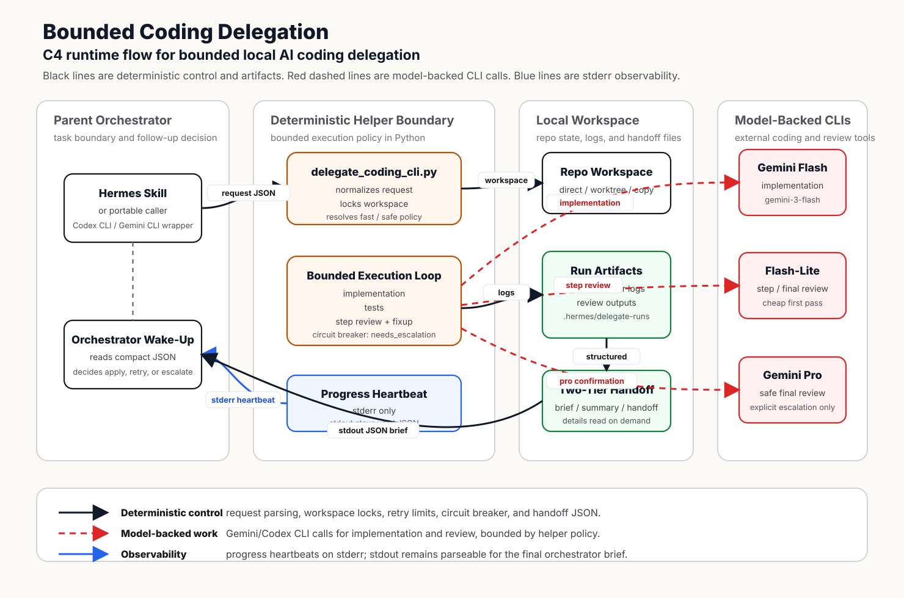

<div align="right">
  <sub>
    <strong>English</strong> |
    <a href="README_CN.md">中文</a>
  </sub>
</div>

# Loop Warden

Loop Warden is a Hermes skill and local Python helper for delegating repository-local coding work to AI coding CLIs such as Gemini CLI and Codex CLI.

It is built around one principle:

**The orchestrator chooses the task boundary. The helper owns the execution loop.**

That means the expensive parent agent should not babysit every implementation, test, review, retry, and cleanup step. The helper runs a bounded local workflow, writes structured artifacts, and returns a tiny JSON brief that the parent orchestrator can parse cheaply.

## Runtime Architecture



This C4-style diagram separates three responsibilities:

- **Parent orchestrator**: defines the task boundary and later decides whether to apply, retry, or escalate.
- **Deterministic helper**: owns workspace locking, model routing, retry limits, heartbeat emission, and structured handoff.
- **Model-backed CLIs**: perform implementation and review calls, but only inside the helper's bounded policy.

The design keeps stdout reserved for the final JSON brief, stderr reserved for progress heartbeats, and detailed logs on disk for selective inspection.

## What It Solves

Local coding-agent workflows often fail in boring but painful places:

| Problem | What Goes Wrong | What This Helper Does |
|:--|:--|:--|
| Process leaks | Child CLIs survive interrupts, timeouts, or stuck pipes. | Tracks process groups and reaps them during timeout, shutdown, and cleanup. |
| Token bloat | The orchestrator reads full logs, review output, and large handoff JSON. | Prints a compact stdout brief and keeps detailed artifacts on disk. |
| No visibility | A long helper run looks frozen until the final JSON appears. | Emits progress heartbeats to stderr without polluting stdout JSON. |
| Weak model loops | Fast models can keep failing the same review and burn retries. | Stops at the fixup boundary and signals `needs_escalation` to the parent. |
| Ad hoc review policy | Every step asks the orchestrator what to do next. | Resolves `quality_mode` once and follows a deterministic review policy. |

## Core Behavior

The helper separates responsibilities:

- **Implementation**: defaults to Gemini CLI with `gemini-3-flash-preview`; Codex CLI can be selected explicitly.
- **Step review**: defaults to `gemini-3.1-flash-lite-preview` for routine checks and fixup decisions.
- **Final review**: safe mode uses `gemini-3.1-pro-preview`; fast mode starts lighter and escalates only when risk warrants it.
- **Parent escalation**: when fixup attempts are exhausted and review still fails, the helper does not auto-upgrade itself. It returns `needs_escalation` so Hermes can resubmit with a stronger model.

## Runtime Pipeline

1. Validate the target repository and requested workspace mode.
2. Create or select a controlled workspace.
3. Build a constrained delegation prompt.
4. Run implementation through Gemini CLI or Codex CLI.
5. Run detected tests when appropriate.
6. Run step review according to the selected policy.
7. Apply bounded fixup rounds when review finds actionable issues.
8. Stop with `needs_escalation` if max fixup attempts are exhausted and review still fails.
9. Otherwise run final review according to `quality_mode`.
10. Write `orchestrator_brief.json`, `summary.json`, `handoff.json`, and logs.
11. Print the final stdout payload as valid JSON.

## Progress Heartbeat

When `stdout_mode` is `brief`, stdout must stay machine-parseable. Progress messages are therefore written only to stderr:

```text
[Heartbeat] Starting Workspace: Preparing direct workspace for /path/to/repo.
[Heartbeat] Generating Implementation: Round 1: running gemini implementation.
[Heartbeat] Running Tests: Round 1: detecting and running configured tests.
[Heartbeat] Step Review [1]: Running first-pass review with gemini-3.1-flash-lite-preview.
[Heartbeat] Fixup Attempt [1]: Running targeted fixup with gemini.
[Heartbeat] Final Review: Running final review in safe mode.
[Heartbeat] Cleanup: Reaping active child processes after implementation run.
```

This gives humans and logs live observability while preserving stdout for downstream JSON parsing.

## Two-Tier Handoff

The default stdout payload is intentionally small:

```json
{
  "success": true,
  "handoff_status": "passed",
  "followup_required": false,
  "escalation_required": false,
  "next_recommended_action": "Inspect the reported diff and logs, then ask before applying, committing, pushing, or deploying.",
  "paths": {
    "handoff": ".hermes/delegate-runs/<timestamp>/handoff.json",
    "summary": ".hermes/delegate-runs/<timestamp>/summary.json",
    "brief": ".hermes/delegate-runs/<timestamp>/orchestrator_brief.json"
  }
}
```

Full artifacts stay under:

```text
.hermes/delegate-runs/<timestamp>/
```

Read only the section the orchestrator actually needs:

```bash
python3 -B scripts/delegate_coding_cli.py --read-handoff .hermes/delegate-runs/<timestamp>/handoff.json --section findings
python3 -B scripts/delegate_coding_cli.py --read-handoff .hermes/delegate-runs/<timestamp>/handoff.json --section tests
python3 -B scripts/delegate_coding_cli.py --read-handoff .hermes/delegate-runs/<timestamp>/handoff.json --section changed_files
```

Available sections are `brief`, `findings`, `tests`, `changed_files`, `attempts`, `logs`, and `full`.

## Run Artifacts

Every helper run writes its intermediate files under:

```text
<workspace>/.hermes/delegate-runs/<timestamp>/
```

The final stdout brief includes the exact `paths.log_dir`, `paths.summary`, and `paths.handoff` values. The most useful files are:

| File | Meaning |
|:--|:--|
| `delegate_prompt.md` | Initial implementation prompt sent to the executor. |
| `delegate_prompt_round_N.md` | Fixup prompt for implementation round `N`. |
| `implementation.stdout.log` / `implementation.stderr.log` | Latest implementation executor output. |
| `implementation_round_N.stdout.log` / `implementation_round_N.stderr.log` | Implementation executor output for fixup round `N`. |
| `tests.json` | Latest detected test results. |
| `tests_round_N.json` | Test results for fixup round `N`. |
| `gemini_review_prompt.txt` | Latest step review prompt. |
| `gemini_review.stdout.log` / `gemini_review.stderr.log` | Latest step review output, normally from `gemini-3.1-flash-lite-preview`. |
| `gemini_review_round_N.stdout.log` / `gemini_review_round_N.stderr.log` | Step review output for fixup round `N`. |
| `gemini_review_pro.stdout.log` / `gemini_review_pro.stderr.log` | Pro confirmation output when a step review escalates. |
| `gemini_review_pro_round_N.stdout.log` / `gemini_review_pro_round_N.stderr.log` | Pro confirmation output for fixup round `N`. |
| `gemini_final_review_flash.stdout.log` / `gemini_final_review_flash.stderr.log` | Final flash-lite review output in fast mode. |
| `gemini_final_review.stdout.log` / `gemini_final_review.stderr.log` | Final pro review output in safe mode, or when fast final review escalates. |
| `orchestrator_brief.json` | The compact payload intended for the parent orchestrator. |
| `summary.json` | Full run summary, including model routing and artifact paths. |
| `handoff.json` | Structured handoff for follow-up, escalation, or detailed inspection. |

## Token Efficiency Metrics

Every completed run records heuristic token estimates in `token_efficiency`:

```json
{
  "token_efficiency": {
    "orchestrator_stdout": {
      "brief_estimated_tokens": 320,
      "full_summary_estimated_tokens": 7800,
      "estimated_tokens_saved_vs_full_summary": 7480,
      "estimated_reduction_vs_full_summary": 0.959
    },
    "artifact_io": {
      "by_category": {
        "implementation_prompts": { "estimated_tokens": 1800 },
        "step_review_outputs": { "estimated_tokens": 420 },
        "final_pro_outputs": { "estimated_tokens": 260 }
      }
    }
  }
}
```

These numbers are estimates, not provider billing. They use a simple heuristic: CJK characters divided by 1.5 plus other characters divided by 4. They answer two practical questions:

- Did compact stdout save orchestrator context compared with reading the full summary or handoff?
- Which stage produced the most prompt/output volume: implementation, flash-lite review, or pro review?

For exact model cost, compare these run artifacts with provider usage or billing logs. For routing decisions, use these estimates as the first warning light: if a task class saves little or nothing, Hermes should handle that class directly next time.

## Dynamic Escalation Signal

The helper is deliberately bounded. If step review still fails after the configured fixup budget, the helper stops and returns:

```json
{
  "success": false,
  "handoff_status": "needs_escalation",
  "followup_required": true,
  "escalation_required": true,
  "next_recommended_action": "Task exceeded max fixup attempts with current executor. Recommend escalating to a stronger model (e.g., gemini-3.1-pro-preview) and resubmitting the task."
}
```

The exact breaker reason is stored in `summary.json` as `error`, `escalation_reason`, and `escalation_error`. The helper does not perform the model upgrade itself; that decision belongs to the parent orchestrator.

## Quality Modes

| Mode | Behavior |
|:--|:--|
| `auto` | Resolves once to `fast` or `safe` from task risk signals. |
| `fast` | Keeps step review rare; final review starts with flash-lite and calls pro only when risk warrants it. |
| `safe` | Runs step review by default, permits high-risk step review confirmation, and always finishes with pro final review unless the circuit breaker stops first. |

## Delegation Boundary

Delegation is not free. The helper is useful when the saved implementation/review context is larger than the orchestration overhead.

Prefer direct Hermes handling for one-line edits, small README changes, git/admin tasks, questions, and targeted fixes likely to touch 1-2 files under roughly 50 lines.

Prefer delegation for likely 3+ files, roughly 100+ changed/generated lines, nontrivial tests, broad debugging, cross-file refactors, substantial code review, or explicit requests to run the bounded Gemini/Codex helper.

Use `quality_mode: fast` for medium work where pro should be rare. Use `quality_mode: safe` only when the final pro review is worth paying for.

## Installation

Clone the repository, then install the skill into Hermes:

```bash
mkdir -p ~/.hermes/skills/devops
cp -R . ~/.hermes/skills/devops/delegate-coding-cli
chmod +x ~/.hermes/skills/devops/delegate-coding-cli/scripts/delegate_coding_cli.py
```

Requirements:

- Python 3
- Git
- Gemini CLI and/or Codex CLI

At least one executor must be available.

## Usage

Create a request JSON file:

```json
{
  "repo": "/path/to/repo",
  "task": "Fix the login loading state after authentication failure.",
  "executor": "auto",
  "mode": "implement",
  "quality_mode": "auto",
  "review": "auto",
  "stdout_mode": "brief",
  "workspace_mode": "direct"
}
```

Run the helper:

```bash
python3 -B scripts/delegate_coding_cli.py --request-json /tmp/delegate-request.json
```

`stdout_mode` controls only the final stdout payload:

| Value | Output |
|:--|:--|
| `brief` | Minimal orchestrator JSON. Default and recommended. |
| `summary` | Compact run summary without full handoff or executor payloads. |
| `full` | Verbose legacy summary for debugging. |

Useful request fields:

| Field | Values |
|:--|:--|
| `mode` | `plan`, `implement`, `review` |
| `executor` | `auto`, `gemini`, `codex` |
| `quality_mode` | `auto`, `fast`, `safe` |
| `workspace_mode` | `direct`, `worktree`, `copy` |
| `review` | `auto`, `always`, `never` |
| `max_fixup_rounds` | Non-negative integer |

## Portability

The core helper is portable to Codex CLI or Gemini CLI because it is just a Python entry point that accepts request JSON and writes machine-readable artifacts. A caller only needs to create a request file and run:

```bash
python3 -B scripts/delegate_coding_cli.py --request-json /tmp/delegate-request.json
```

What is Hermes-specific is the skill wrapper and the instruction style around when to invoke it. To use the same design from another CLI, add a small wrapper prompt or command convention that:

- writes the request JSON;
- launches `delegate_coding_cli.py`;
- reads stdout as the compact brief;
- reads `handoff.json` sections only when details are needed;
- avoids recursive loops when the parent CLI and executor CLI are the same tool.

In practice, Codex CLI or Gemini CLI can use this as a local helper today. Turning it into a first-class skill for another agent environment mostly means rewriting the wrapper instructions, not rewriting the Python execution engine.

## Safety Boundaries

The helper is conservative by design:

- It refuses broad or sensitive repository paths.
- It does not push, merge, deploy, or publish.
- It sanitizes sensitive environment variables before child CLI calls.
- It writes prompts to files and invokes subprocesses without shell interpolation.
- It uses workspace locks to avoid concurrent helper runs in the same workspace.
- It tracks child process groups and cleans them up on timeout, interrupt, and shutdown.

## Repository Layout

```text
.
├── SKILL.md
├── README.md
├── README_CN.md
├── LICENSE
├── docs
│   └── c4-delegation-flow.svg
└── scripts
    └── delegate_coding_cli.py
```

## Project Status

This is an MVP extracted from an active Hermes workflow. The goal is not to replace high-level orchestration; it is to make the local execution layer bounded, observable, and cheap to hand off.
